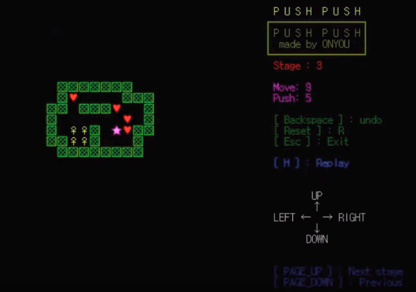

### 개요
 - 본 프로젝트는 방향키를 사용하여 하트를 박스에 모두 밀어 넣어야 스테이지가 클리어 되는 콘솔 게임입니다.
 - 시연 영상 링크 : https://youtu.be/Dwz26ZY_U00
	
### 내용

1. 텍스트 출력과 텍스트 지우기의 반복에 의하여 2차원 배열로 구성된 맵이 움직이는 것을 연출하였습
2. 현재 스테이지와 움직인 횟수, 박스를 민 횟수를 별 모양이 움직일 때 마다 갱신하도록 작성하였습니다.
3. 다양한 키보드 키로 별 모양이 움직이거나 , 취소(Undo)하는 기능, 해당 스테이지 다시 시작, 스테이지 점프, 종료의 기능을 구현하였습니다.
4. 마지막으로 게임이 끝난 뒤 리 플레이가 가능하며, 게임을 다시 열었을 때는 지난 게임을 이어서 할 수 있도록 하였습니다.
